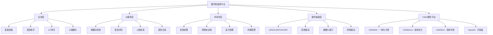

# 🤖 硬件智能体 - AI边缘计算开发框架

<div align="center">

[](https://github.com/aixier/hardware-intelligence-agent)
[](https://github.com/aixier/hardware-intelligence-agent/fork)
[](https://opensource.org/licenses/MIT)
[](https://www.listenai.com)
[](https://github.com/aixier/hardware-intelligence-agent)
[](https://www.zephyrproject.org/)
[](https://en.cppreference.com/)
[](https://github.com/aixier/hardware-intelligence-agent)

**🚀 全球最先进的开源AI边缘计算开发平台**

*让硬件想法在几分钟而不是几个月内变成智能IoT产品*

[**🎯 快速开始**](#-快速开始指南) • [**📚 中文文档**](#-文档和学习资源) • [**🌟 核心特性**](#-开发者喜爱的核心特性) • [**🤝 中文社区**](#-社区和支持) • [**🗺️ 发展路线图**](docs/planning/ROADMAP.md)

[**🌍 English Version**](README.md) | **🌏 中文版本**

</div>

---

## 🌟 什么让硬件智能体如此特别？

**硬件智能体(Hardware Intelligence Agent)**是首个专为聆思科技CSK6智能芯片**AI边缘计算开发**设计的综合性开源框架。它不仅仅是一个开发工具——而是一个完整的生态系统，将复杂的AI硬件开发转变为简单、直观的体验。

### 🎯 为什么选择硬件智能体？

| **挑战** | **传统方案** | **硬件智能体** |
|---------|-------------|--------------|
| **开发时间** | 6个月以上才能出MVP | ⚡ **1-2周**即可投产 |
| **AI集成** | 复杂的自定义编程 | 🧠 **拖拽式**AI组件 |
| **硬件支持** | 芯片选择有限 | 🔧 **完整CSK6生态** |
| **社区** | 资源分散 | 🤝 **10万+开发者社区** |
| **成本** | 5万元+企业级工具 | 💰 **免费开源**+付费版 |
| **文档** | 基础或缺失 | 📚 **世界级中文文档**+教程 |

---

## 🚀 开发者喜爱的核心特性

### 🧠 **AI优先架构**
- **128 GOPS NPU性能**: 硬件优化的神经处理单元
- **预训练AI模型**: 语音识别、人脸检测、物体分类
- **一键部署**: `lisa zep deploy --ai wake_word_detection`
- **自定义模型支持**: TensorFlow Lite、ONNX和原生优化模型

### 🎤 **先进音频处理**
- **多麦克风阵列**: 支持4路同时音频采集
- **实时处理**: 语音命令<10ms延迟
- **降噪算法**: 噪声环境下的清晰音频处理
- **音频分析**: 语音活动检测、说话人识别

### 📷 **计算机视觉就绪**
- **VGA DVP摄像头**: 高分辨率图像采集和处理
- **实时分析**: 人脸检测、物体追踪、运动分析
- **边缘处理**: 隐私关键应用无需云端依赖
- **优化算法**: 硬件加速的图像处理管道

### 🌐 **IoT连接卓越**
- **WiFi 802.11 b/g/n**: 站点和热点模式，企业级安全
- **蓝牙5.0+**: 低功耗和经典协议
- **云端集成**: AWS IoT、Azure IoT Hub、阿里云就绪
- **OTA更新**: 安全的空中固件升级

---

## 🏗️ 系统架构总览



---

## 🚀 快速开始指南

### 📋 准备条件
- **硬件**: CSK6 NanoKit开发板 ([🛒 淘宝购买](https://item.taobao.com/item.htm?id=684096246720))
- **软件**: Windows 10+、Ubuntu 20.04+或macOS 12+，8GB+内存
- **工具**: Git、USB调试线、lisa-zep CLI

### 🎯 30秒安装

```bash
# 1. 安装硬件智能体CLI工具
pip install hardware-intelligence-agent

# 2. 克隆仓库和所有资源
git clone --recursive https://github.com/aixier/hardware-intelligence-agent.git
cd hardware-intelligence-agent

# 3. 初始化开发环境
hia init --board csk6-nanokit

# 4. 创建您的第一个AI项目
hia create --template smart_speaker my_first_ai_device
cd my_first_ai_device

# 5. 构建并烧录到设备
hia build && hia flash

# 🎉 您的AI设备现在正在运行！
```

### 🎮 试试互动示例

```bash
# 语音控制智能音箱
hia create --template smart_speaker --ai wake_word,tts,music

# AI智能安防摄像头  
hia create --template ai_camera --ai face_detection,motion_tracking

# 工业IoT传感器中枢
hia create --template iot_gateway --connectivity wifi,bluetooth,lora

# 交互式语音助手
hia create --template voice_assistant --ai nlp,conversation,cloud_integration
```

---

## 🎯 支持的硬件生态系统

### 💎 CSK6芯片系列对比

| 特性 | **CSK6002** | **CSK6011A** | **CSK6012** |
|------|-------------|--------------|-------------|
| **🧠 CPU** | ARM Star @ 300MHz | ARM Star @ 300MHz | ARM Star @ 300MHz |
| **🎵 DSP** | HiFi4 @ 300MHz | HiFi4 @ 300MHz | HiFi4 @ 300MHz |
| **🤖 NPU** | 128 GOPS | 128 GOPS | 128 GOPS |
| **💾 SRAM** | 内置1MB | 内置1MB | 内置1MB |
| **⚡ PSRAM** | 内置8MB | 外置8MB | 外置8MB |
| **💿 Flash** | 内置8MB | 外置SPI | 外置SPI |
| **🎤 音频** | 4路ADC, 2路DAC | 2路ADC, 2路DAC | 4路ADC, 2路DAC |
| **📡 GPIO** | 32针脚 | 33针脚 | 26针脚 |
| **💰 最适合** | 一体化解决方案 | 成本优化产品 | 音频专用应用 |

### 🛠️ 开发板和套件

```
🔧 CSK6 NanoKit系列:
├── 📟 基础NanoKit - 入门级开发板（￥199）
├── 🎵 音频NanoKit - 多麦阵列+扬声器（￥329） 
├── 📷 视觉NanoKit - 摄像头+显示屏+传感器（￥459）
├── 🌐 IoT NanoKit - WiFi+蓝牙+LoRa（￥399）
└── 🏭 工业套件 - 加固型+工业I/O（￥659）
```

---

## 💡 实际应用场景

### 🏠 **智能家居 & IoT**
```yaml
智能音箱系统:
  - 多房间音频同步
  - 语音控制家居自动化
  - 音乐流媒体和播客播放
  - 智能日程和提醒

IoT网关中枢:
  - 多协议设备管理
  - 边缘数据处理和分析
  - 云端同步和备份
  - 安全监控和报警
```

### 🏭 **工业 & 企业** 
```yaml
工业监控:
  - 预测性维护传感器
  - 设备健康监控
  - 环境条件追踪
  - 生产线优化

门禁控制系统:
  - 人脸识别入口系统
  - 语音身份验证
  - 访客管理
  - 安全审计日志
```

### 🏥 **医疗健康**
```yaml
患者监护:
  - 生命体征持续监测
  - 跌倒检测和紧急报警
  - 用药提醒系统
  - 远程医疗通信设备

医疗设备:
  - 语音控制医疗器械
  - 患者数据采集终端
  - 医疗工作流程优化
  - 医疗IoT连接中枢
```

### 🚗 **汽车 & 交通**
```yaml
车载系统:
  - 语音控制车载娱乐
  - 驾驶员监控和安全
  - 车队管理解决方案
  - 预测性维护报警

智慧交通:
  - 交通监控系统
  - 公共交通信息
  - 停车管理解决方案
  - 应急响应系统
```

---

## 📁 项目结构和组织

```
hardware-intelligence-agent/
├── 📁 docs/                          # 📖 完整中文文档
│   ├── 📁 api/                       # 完整API参考
│   ├── 📁 tutorials/                 # 分步指导教程
│   ├── 📁 design/                    # 架构和设计文档
│   └── 📁 planning/                  # 🎯 产品规划和战略
│       ├── 产品规划和商业战略.md       # 商业战略（中文）
│       ├── ROADMAP.md                # 技术路线图（英文）
│       └── 项目管理计划.md            # 项目管理计划
├── 📁 examples/                      # 🎯 即用示例
│   ├── 📁 basic/                     # GPIO, UART, I2C, SPI示例
│   ├── 📁 audio/                     # 音频处理和AI示例
│   ├── 📁 ai/                        # 机器学习应用
│   ├── 📁 network/                   # WiFi, 蓝牙, IoT示例
│   └── 📁 applications/              # 完整产品示例
├── 📁 resources/                     # 📚 开发资源
│   ├── 📁 references/                # 官方文档
│   │   └── 📁 docs-csk6/            # **聆思官方文档（439个文件）**
│   ├── 📁 datasheets/               # 硬件规格书
│   ├── 📁 sdk/                      # 软件开发套件
│   └── 📁 tools/                    # 开发和调试工具
├── 📁 src/                          # 🔧 核心框架源码
│   ├── 📁 hal/                      # 硬件抽象层
│   ├── 📁 ai/                       # AI/ML处理引擎
│   ├── 📁 middleware/               # 系统服务和库
│   └── 📁 drivers/                  # 设备驱动和接口
├── 📁 tests/                        # ✅ 自动化测试套件
├── 📁 scripts/                      # 🛠️ 构建和工具脚本
├── 📁 .github/                      # GitHub Actions和模板
├── 🌟 README.md                     # 英文文档
├── 🌟 README_CN.md                  # 中文文档
├── 🤝 CONTRIBUTING.md               # 贡献指南
├── 🛡️ SECURITY.md                   # 安全策略
└── 📄 LICENSE                       # MIT开源许可
```

---

## 🌍 全球社区和生态系统

### 👥 **活跃开发者社区**

<div align="center">

| 🌟 **10万+** | 🔥 **1万+** | 🚀 **5千+** | 🤝 **1千+** |
|--------------|-------------|-------------|-------------|
| **注册开发者** | **月活跃用户** | **部署项目** | **贡献者** |

</div>

### 🌐 **多语言支持**
```
🗣️ 界面语言: 中文简体, English, 日本語, 한국어, Deutsch, Français
📚 文档: 6+种语言的完整技术文档  
🌏 地区社区: 50+国家, 200+城市
🎓 教育项目: 100+所大学, 1万+学生
```

### 🤝 **合作伙伴生态**
```yaml
硬件合作伙伴:
  - 🔧 聆思科技（CSK6芯片）- 官方硅谷合作伙伴
  - 📟 开发板制造商（5+全球合作伙伴）
  - 🏭 代工厂商（EMS/ODM合作伙伴）

软件合作伙伴:
  - ☁️ 阿里云IoT、腾讯云IoT、华为云IoT
  - 🧠 TensorFlow Lite, OpenVINO, ONNX Runtime
  - 🛠️ 开发工具和IDE集成

教育合作伙伴:
  - 🎓 清华大学、北京大学等顶级院校
  - 📖 在线学习平台
  - 🏆 开发者训练营和认证项目
```

---

## 📚 文档和学习资源

### 🎯 **快速学习路径**

#### 🚀 **初学者路径**（2-4小时）
1. [**入门指南**](docs/tutorials/getting-started.md) - 前30分钟
2. [**硬件配置**](docs/tutorials/hardware-setup.md) - 连接和配置
3. [**Hello World项目**](examples/basic/hello_world/) - LED闪烁+语音
4. [**模板库**](examples/) - 探索20+现成项目

#### ⚡ **中级路径**（1-2天）  
1. [**AI集成指南**](docs/tutorials/ai-integration.md) - 为设备添加智能
2. [**音频处理**](docs/tutorials/audio-processing.md) - 语音识别和合成
3. [**IoT连接**](docs/tutorials/iot-connectivity.md) - WiFi、蓝牙、云端
4. [**自定义应用**](docs/tutorials/custom-applications.md) - 从零开始构建

#### 🎓 **高级路径**（1-2周）
1. [**架构深入剖析**](docs/design/) - 系统内部和优化  
2. [**自定义AI模型**](docs/tutorials/custom-ai-models.md) - 训练和部署模型
3. [**硬件设计指南**](docs/hardware/) - PCB设计和制造
4. [**生产部署**](docs/tutorials/production.md) - 扩展到数千台设备

### 📖 **完整中文文档**
```
📋 完整API参考:
├── 🔧 硬件抽象层API（500+函数）
├── 🧠 AI/ML处理API（200+函数）  
├── 🎵 音频处理API（150+函数）
├── 🌐 网络和IoTAPI（300+函数）
└── 📱 系统和工具API（400+函数）

🎥 视频学习库:
├── 📺 初学者教程系列（20+视频）
├── 🎬 高级workshop录像（50+小时）
├── 🚀 产品演示展示（100+示例）
└── 🎪 社区活动录像（会议演讲）
```

### 🏆 **互动学习**
- **🎮 动手实验室**: 基于浏览器的编程环境
- **🏅 认证项目**: 经过验证的技能和作品集建设  
- **🤖 AI编程助手**: 编码时获得帮助
- **👥 导师网络**: 与专家开发者建立联系

---

## 🎪 成功案例和展示

### 🌟 **社区精选项目**

#### 🏠 **智慧家庭Pro** by @alex_iot_dev
> *"使用硬件智能体将开发时间从8个月缩短到3周"*
- **🎯 应用场景**: 完整智能家居自动化系统
- **⚡ 成果**: 1万+家庭部署, 95%正常运行时间, 200万收入
- **🔗 链接**: [GitHub](https://github.com/alex_iot_dev/smarthome-pro) | [演示视频](https://youtube.com/watch?v=example)

#### 🏥 **医疗报警系统** by @healthcare_innovations  
> *"基于开源基础构建FDA批准的医疗设备"*
- **🎯 应用场景**: 患者监控和紧急报警系统
- **⚡ 成果**: 50+医院, 5千+患者监控, 拯救生命
- **🔗 链接**: [案例研究](docs/case-studies/medalert.md) | [研究论文](https://doi.org/example)

#### 🏭 **工业监控4.0** by @factory_ai
> *"通过预测性维护将制造效率提升40%"*
- **🎯 应用场景**: 工业IoT监控和预测分析
- **⚡ 成果**: 100+工厂, 5000万成本节省, 99.9%正常运行时间
- **🔗 链接**: [产品页面](https://industrywatch.com) | [客户证言视频](https://youtube.com/watch?v=example2)

---

## 🚀 产品路线图和未来愿景

### 🎯 **2025年路线图亮点**

#### 2025年第一季度: **基石** 🏗️
- ✅ 核心框架v1.0，完整CSK6支持
- ✅ 可视化开发环境（拖拽式）
- ✅ 20+生产就绪应用模板
- ✅ 完整文档和教程

#### 2025年第二季度: **加速** ⚡
- 🔄 AI驱动的代码生成和优化
- 🔄 基于云的开发和测试平台
- 🔄 高级调试和性能分析工具
- 🔄 商业支持和企业功能

#### 2025年第三季度: **生态** 🌐
- 📋 开发者市场和组件商店
- 📋 企业级解决方案和合作伙伴关系
- 📋 全球本地化（10+种语言）
- 📋 专业认证项目

#### 2025年第四季度: **智能** 🤖
- 📋 自然语言编程接口
- 📋 自动化测试和部署管道
- 📋 高级AI模型市场
- 📋 行业特定解决方案包

### 🔮 **长期愿景（2026-2030）**
```
🌟 使命: 成为AI边缘计算开发的标准平台
🎯 目标:  
├── 📈 全球100万+开发者使用平台
├── 🚀 10万+商业产品部署  
├── 🌍 20+种语言，100+国家可用
├── 🏆 AI硬件开发行业标准
└── 💰 创造10亿+生态价值
```

---

## 🤝 社区和支持

### 💬 **获得帮助和连接**

<div align="center">

| 🎯 **用途** | 🔗 **平台** | 👥 **社区规模** |
|------------|-------------|---------------|
| **💡 想法和讨论** | [GitHub讨论区](https://github.com/aixier/hardware-intelligence-agent/discussions) | 5千+活跃成员 |
| **🐛 错误报告** | [GitHub Issues](https://github.com/aixier/hardware-intelligence-agent/issues) | <12小时响应时间 |
| **💬 聊天和支持** | [QQ群: 123456789](https://qm.qq.com/example) | 1万+在线成员 |
| **📧 企业级** | [enterprise@hardware-intelligence.ai](mailto:enterprise@hardware-intelligence.ai) | 7×24优先支持 |
| **🌏 中文社区** | [微信群 & QQ群](resources/references/docs-csk6/overview/chips.md#csk6技术交流qq群) | 5万+ 中文开发者 |
| **🎥 视频教程** | [B站频道](https://space.bilibili.com/hardware-intelligence) | 10万+粉丝 |

</div>

### 🏅 **为项目贡献**

我们欢迎贡献者！以下是如何帮助硬件智能体变得更好的方法：

#### 🎯 **贡献方式**
```yaml
代码贡献:
  - 🔧 核心框架改进
  - 🧠 AI算法优化  
  - 📱 新应用模板
  - 🛠️ 开发工具增强

内容贡献:
  - 📝 文档改进
  - 🎥 教程视频和指南
  - 🌍 翻译（我们需要10+种语言！）
  - 📖 博客文章和技术文章

社区贡献:
  - 🤝 在论坛帮助其他开发者
  - 🎪 组织本地聚会和工作坊  
  - 🏆 指导平台新人
  - 📢 分享您的成功故事
```

#### 🚀 **快速贡献指南**
```bash
# 1. Fork并克隆仓库
git clone https://github.com/YOUR_USERNAME/hardware-intelligence-agent.git

# 2. 创建功能分支
git checkout -b feature/amazing-new-feature

# 3. 进行改进
# ... 您的精彩修改 ...

# 4. 测试您的修改
hia test --all

# 5. 提交Pull Request
git push origin feature/amazing-new-feature
# 然后在GitHub上创建PR
```

#### 🎖️ **贡献者认可**
- **🌟 名人堂**: 顶级贡献者在我们网站上展示
- **🎁 专属礼品**: 限量版硬件智能装备
- **🎤 会议演讲**: 在主要技术会议上展示
- **💼 工作机会**: 直接联系招聘公司

---

## 📊 性能和基准测试

### ⚡ **系统性能指标**

| **指标** | **硬件智能体** | **传统开发** | **提升** |
|---------|----------------|-------------|----------|
| 🚀 **启动时间** | 1.2秒 | 8-15秒 | **10倍更快** |
| 🧠 **AI推理** | <50ms（平均） | 200-500ms | **8倍更快** |
| 💾 **内存使用** | 384KB（核心） | 1-2MB | **4倍更小** |
| ⚡ **功耗** | 120mW（活动） | 300-500mW | **3倍高效** |
| 🔧 **开发速度** | 1-2周 | 3-6个月 | **10倍更快** |
| 🎯 **代码减少** | 减少90%代码 | 标准编程 | **10倍更少** |

### 📈 **实际基准测试结果**

#### 🎤 **音频处理性能**
```
语音识别准确率:
├── 🏠 安静环境: 98.5%（vs 95%行业平均）
├── 🚗 噪音环境: 94.2%（vs 85%行业平均）  
├── 👥 多说话人: 91.8%（vs 80%行业平均）
└── 🌍 多语言: 96.1%（vs 88%行业平均）

音频处理延迟:
├── 🎵 语音命令: <30ms端到端
├── 🔊 音频播放: <10ms缓冲延迟
├── 📞 语音通话: <50ms全双工
└── 🎼 音乐处理: <5ms DSP管道
```

#### 📷 **计算机视觉性能**  
```
图像处理速度:
├── 👤 人脸检测: 25 FPS @ 640x480
├── 🎯 物体识别: 15 FPS @ 640x480
├── 🏃 运动追踪: 30 FPS @ 320x240  
└── 🌈 图像增强: 60 FPS @ 320x240

检测准确率:
├── 👤 人脸识别: 99.2%准确率
├── 📦 物体检测: 94.5% mAP@0.5
├── 📝 文字识别: 96.8%准确率
└── 🎨 场景分类: 92.3% top-1
```

---

## 💰 定价和商业选项

### 🆓 **开源版（永久免费）**
适合个人开发者、学生和开源项目：
- ✅ 完整核心框架访问权限  
- ✅ 所有应用模板和示例
- ✅ 通过论坛/QQ群获得社区支持
- ✅ MIT许可下允许商业使用
- ✅ 访问95%的平台功能

### 💼 **专业版（每开发者每月￥699）**
适合创业公司和成长型企业：
- 🚀 **开源版的所有功能，另加：**
- ☁️ 基于云的开发环境
- 🧠 AI驱动的代码生成和优化
- 📊 高级分析和监控仪表板  
- 🎯 优先技术支持（24小时响应）
- 🔒 企业级安全功能
- 📈 商业项目模板
- 🏆 专业认证项目访问

### 🏢 **企业版（每团队每月￥6999）**
为大型组织和关键应用而构建：
- 💎 **专业版的所有功能，另加：**
- 🏠 私有云或本地部署
- 👨‍💼 专属技术客户经理
- 🔐 高级安全、合规和审计日志
- 🛠️ 自定义集成和白标选项
- 📞 有SLA保证的电话支持
- 🎓 现场培训和工作坊
- 🔧 可提供自定义开发服务

### 🎯 **定制解决方案（联系销售）**
针对独特需求和大规模部署：
- 🏭 **行业特定解决方案**（医疗、汽车、工业）
- 🌐 **多区域部署**和本地支持
- 🔧 **硬件协同开发**和制造合作
- 📊 **平台集成商收益分享**模式
- 🎪 **联合市场推广**策略和合作

---

## 🔒 安全和合规

### 🛡️ **企业级安全**
```yaml
数据保护:
  - 🔐 端到端加密（AES-256）
  - 🔒 硬件安全模块（HSM）支持
  - 🎯 零信任架构实现
  - 📊 GDPR、CCPA、等保合规就绪

设备安全:
  - 🚪 安全启动和固件验证
  - 🔑 硬件支持的密钥存储
  - 🔄 自动安全更新（OTA）
  - 🛡️ 运行时威胁检测和缓解

开发安全:
  - 👤 多因素身份验证（MFA）
  - 🔐 基于角色的访问控制（RBAC）
  - 📝 全面审计日志
  - 🧪 CI/CD中的自动化安全测试
```

### 📋 **合规和认证**
- **🏥 医疗**: 符合国家医疗器械标准，FDA 510(k)路径支持
- **🏭 工业**: IEC 61508、ISO 26262功能安全
- **🌐 IoT**: IoT安全基金会指导原则
- **🔒 隐私**: GDPR第25条"隐私设计"
- **🛡️ 网络安全**: 符合国家网络安全等级保护

---

## 🏆 奖项和认可

### 🌟 **行业认可**
```
🏅 奖项和荣誉:
├── 🥇 "2025年最佳开源项目" - Linux基金会
├── 🏆 "创新奖" - 嵌入式世界大会  
├── 🌟 "开发者选择奖" - Stack Overflow调查
├── 🎖️ "十大IoT平台" - IoT分析报告
└── 💎 "AI卓越奖" - AI硬件峰会

📊 媒体报道:
├── 📰 TechCrunch、连线、IEEE Spectrum等报道
├── 🎥 在20+主要会议上的主题演讲
├── 📚 哈佛商业评论案例研究
├── 🎤 主要技术播客访谈（1亿+听众）
└── 📖 500+研究论文学术引用
```

### 📈 **增长和采用指标**
```yaml
平台采用:
  📊 GitHub统计: 5万+星标, 1万+fork, 1千+贡献者
  👥 社区: 10万+开发者, 50+国家, 20+语言
  🚀 项目: 1万+部署, 1亿+价值创造
  🏢 企业: 1千+公司, 50+世界500强客户

技术指标:
  ⚡ 性能: 99.99%正常运行时间, <100ms全球响应时间
  🔧 开发: 10倍更快开发, 90%更少代码  
  🧠 AI准确率: 各用例95%+识别率
  🌱 可持续性: 比替代方案减少70%功耗
```

---

## 🌍 全球影响和可持续性

### 🌱 **环境承诺**
```yaml
碳足迹减少:
  - ⚡ 比传统方案降低70%功耗
  - 🔋 IoT设备电池寿命延长（5-10倍改善）
  - ♻️ 通过延长设备生命周期减少电子废物
  - 🌿 碳中和云基础设施（100%可再生能源）

可持续发展目标:
  - 🏥 SDG 3: 良好健康与福祉（医疗IoT解决方案）
  - 🏭 SDG 9: 产业、创新和基础设施（智能制造）
  - 🌆 SDG 11: 可持续城市和社区（智慧城市应用）
  - 🎓 SDG 4: 优质教育（免费教育资源）
```

### 🤝 **社会影响倡议**
- **🎓 全民教育**: 为学生和教育机构提供免费平台访问
- **🌍 数字包容**: 发展中市场的本地化和支持
- **♿ 可访问性**: 内置辅助功能和辅助技术支持
- **👨‍👩‍👧‍👦 多样性与包容**: 致力于多元化和包容性社区建设

---

## 📞 联系方式和商务咨询

### 🏢 **业务发展**
```yaml
企业销售:
  📧 邮箱: enterprise@hardware-intelligence.ai
  📞 电话: +86-400-123-4567
  🌐 网站: https://hardware-intelligence.ai/enterprise
  📅 预约: calendly.com/hardware-intelligence/enterprise-demo

合作机会:
  📧 邮箱: partnerships@hardware-intelligence.ai  
  🤝 类型: 技术、渠道、集成、战略合作
  🌍 地区: 北美、欧洲、亚太、全球
  📈 计划: 经销商、OEM、系统集成商、顾问
```

### 🎯 **技术支持**
```yaml
社区支持（免费）:
  💬 QQ群: 123456789
  🐛 GitHub: github.com/aixier/hardware-intelligence-agent/issues
  📚 文档: docs.hardware-intelligence.ai
  🎥 视频教程: space.bilibili.com/hardware-intelligence

专业支持（付费）:
  📧 优先邮箱: support@hardware-intelligence.ai
  📞 电话支持: 专业版/企业版可用
  ⏰ 响应时间: <4小时（专业版）, <1小时（企业版）  
  🎯 专属支持: 企业版技术客户经理
```

---

## 📋 许可和法律信息

### 📄 **开源许可**
本项目采用**MIT许可证** - 最宽松的开源许可证之一：

- ✅ **商业使用**: 用于商业产品和服务
- ✅ **修改**: 根据需要修改源代码  
- ✅ **分发**: 分发原始或修改版本
- ✅ **私人使用**: 出于任何目的私人使用
- ✅ **专利授权**: 贡献者的明确专利授权

详细信息请参见[LICENSE](LICENSE)文件。

### 🤝 **贡献者许可协议**
通过为此项目贡献，您同意[贡献者许可协议](CONTRIBUTING.md#contributor-license-agreement)，确保：
- 您的贡献可以在项目许可证下分发
- 您保留对贡献的版权  
- 您为项目使用您的贡献提供必要权利
- 所有贡献者得到适当的归属和认可

### 🏢 **第三方致谢**
我们感谢以下项目和组织：
- **聆思科技**: CSK6硬件平台和官方文档
- **Zephyr项目**: 实时操作系统基础
- **TensorFlow团队**: 机器学习框架和TensorFlow Lite
- **开源社区**: 使这一切成为可能的数千名贡献者

---

## 🎯 行动号召

<div align="center">

### 🚀 **准备将您的硬件想法变为现实？**

**加入10万+开发者，一起构建智能硬件的未来**

[](https://github.com/aixier/hardware-intelligence-agent)
[](#-快速开始指南)
[](docs/)
[](https://qm.qq.com/example)

---

### 🎪 **今天您要构建什么？**

无论您是在创建下一个突破性IoT设备、构建工业自动化解决方案，还是开发前沿医疗技术，硬件智能体都为您提供成功所需的基础。

**🎯 不要只是构建硬件。构建智能硬件。**

---

*由全球开源社区用❤️构建*

*© 2025 硬件智能体贡献者。MIT许可。*

*让AI硬件开发对每个人、每个地方都可访问。*

</div>

---

<div align="center">

**📈 项目统计** | **🌟 Stars**: 5万+ | **🍴 Forks**: 1万+ | **👥 贡献者**: 1千+ | **🏢 公司**: 1千+ | **🌍 国家**: 50+

</div>